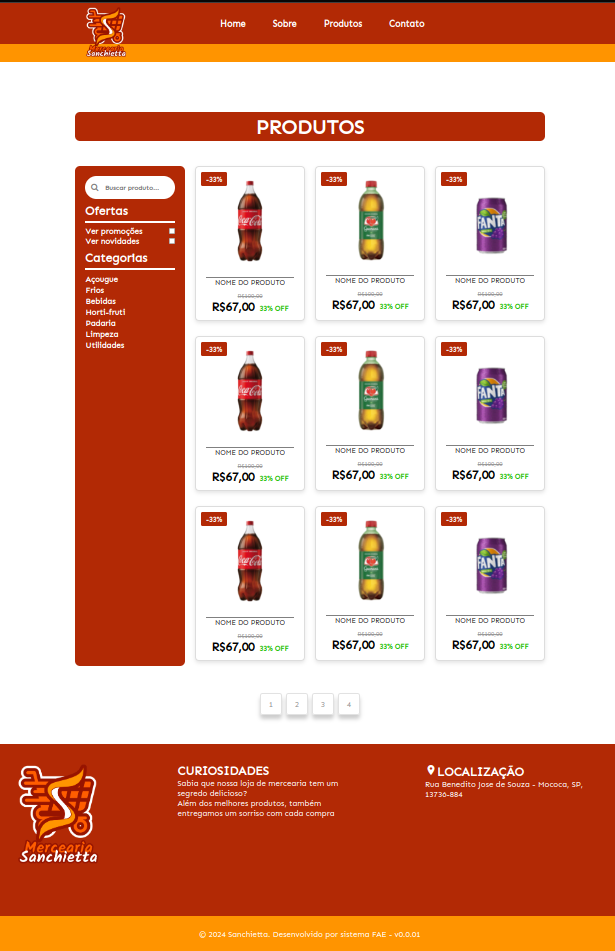

# Projeto de Website

Este projeto é um website simples construído com HTML e CSS. Ele não é responsivo e foi projetado para uma largura fixa de 940 pixels. Desenvolvido Para Trabalho Do 1 Semestre Do Curso De Engenharia De Sofware sendo melhorado com o passar dos semestres.

## Imagens das Páginas em HTML e CSS

### Home
A página inicial do website.

 

### Sobre

 

### Produtos

 

### Contato

 

### Detalhe De Pedido

 
